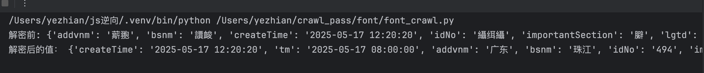
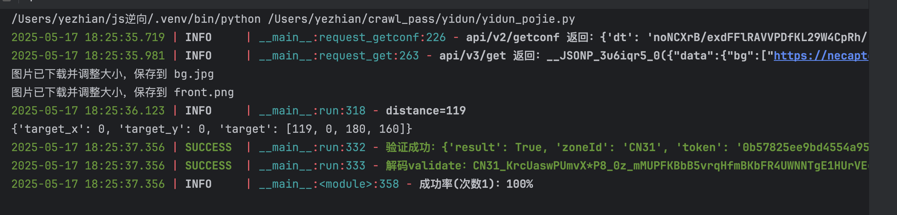
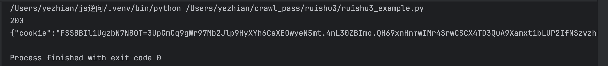
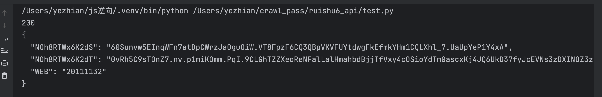
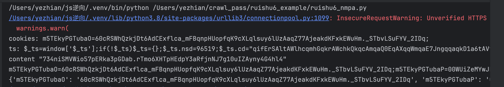

# crawl_pass

### 介绍
#### 这是一个爬虫研究的项目，用于破解常见的反扒，代码简单易执行，部分能集成到docker透出端口
#### 如果对您有帮助，麻烦帮忙加星点赞

### 软件架构
软件架构说明：基于python3.8 node.js chrome

### 安装教程

1.  克隆项目： https://gitee.com/yezhian/crawl_pass.git
2.  拉取：Username for 'https://gitee.com': yezhian Password for 'https://yezhian@gitee.com': 私人令牌：联系本人qq 1948521244
3.  本人本地运行是基于mac m 芯片的macbook，python3.8，线上基于阿里云的ubuntu服务器

### 目录
#### 支持：五秒盾 字体反扒 易盾滑块 瑞数3 瑞数6

### 使用说明

#### 1. 5s 盾 
### （1）付费版本 charge_version_5s.py
        测试站点： aHR0cHM6Ly9jbi5haXJidXNhbi5jb20vY29udGVudC9jb21tb24vY3VzdG9tZXJjZW50ZXIvbm90aWNlTGlzdA==
### （2）免费版本：free_version_5s.py
        测试站点：aHR0cHM6Ly93d3cuY2hpbmF0aW1lcy5jb20vP2NoZHR2
#### 2.  字体反扒：font_crawl.py
    测试站点:aHR0cDovL3h4ZmIubXdyLmNuL3NxX2R4c2suaHRtbA==
    1. 字体文件不断在变化
    2. 每次请求会生成新的.ttf和xml文件
###效果：

#### 3. 易盾滑块 yidun_pojie.py
    测试站点： aHR0cHM6Ly9nb3ZzLm1paXQtZWlkYy5vcmcuY24vbWlpdHh4Z2svZ29uZ2dhby94eGdrL3F1ZXJ5QnlQYz9wYz0zOTAmcXVlcnlsYj1jcCZxeWluZm9sYj0=
### 需要注意的点：
    （1）版本会变化version，需根据实际调整
    （2）图片的宽度为320
    （3）滑块的距离识别有二种方法都可行，第一种成功率更高95%，第二种75%（基于某次测试样本数20） 
### 效果：

#### 4. 瑞数3
#### 用法：
    （1）liunx 运行 ./ruishu
    （2）请求：5555端口
    启动文件会透出5555端口，本人在阿里云的服务器上部署了一个，测试站点为：aHR0cHM6Ly93d3cuY2RlLm9yZy5jbi9tYWluL3h4Z2svbGlzdHBhZ2UvOWY5Yzc0YzczZTBmOGY1NmE4YmZiYzY0NjA1NTAyNmRh
    运行样例脚本：ruishu3_example.py
### 运行结果:

#### 5. 瑞数6 api
#### 用法：
    测试站点：aHR0cDovL2VwdWIuY25pcGEuZ292LmNu
    运行：ruishu6_api/test.py
#### docker 镜像创建
    1. cd ruishu6_api
    2. docker build -t ruishu6_api .
    3. docker run -d -p 3000:3000 ruishu6_api
### 注意
    1.可以在app.py对请求加上代理避免接口所在的机器被封
    2.可以集成到scrapy的下载中间组件
### 运行结果:

#### 6. 瑞数6 example
#### 用法：
    测试站点：aHR0cHM6Ly8xMTQuMjUxLjEwLjkyL1hZUFQvdW5pdC9saXN0
    运行：ruishu6_example/ruishu6_nmpa.py
### 运行结果:

### 参与贡献
1.  Fork 本仓库
2.  新建 Feat_xxx 分支
3.  提交代码
4.  新建 Pull Request
